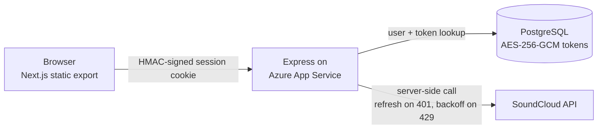

<p align="center">
  <a href="https://tracktoolkit.com">
    <picture>
      <source media="(prefers-color-scheme: dark)" srcset="https://raw.githubusercontent.com/cole-hackman/tracktoolkit/main/frontend-UI/public/brand/wordmark-dark.svg">
      <source media="(prefers-color-scheme: light)" srcset="https://raw.githubusercontent.com/cole-hackman/tracktoolkit/main/frontend-UI/public/brand/wordmark.svg">
      
    </picture>
  </a>
</p>

<h3 align="center">Clean up a SoundCloud library in bulk</h3>

<p align="center">
  SoundCloud makes you unlike, unfollow, and re-sort one click at a time.<br>
  Track Toolkit does it in batches — for DJs and collectors with thousands of tracks.
</p>

<p align="center">
  <sub>formerly known as SoundCloud Toolkit</sub>
</p>

<p align="center">
  <a href="https://tracktoolkit.com">🌐 Live site</a> ·
  <a href="docs/SECURITY.md">🔒 Security model</a> ·
  <a href="#-run-it-locally">🚀 Run locally</a>
</p>

<p align="center">
  <a href="https://github.com/cole-hackman/tracktoolkit/actions/workflows/azure-deploy.yml"></a>
  <a href="https://tracktoolkit.com/api/stats/public"></a>
  <a href="https://tracktoolkit.com/api/stats/public"></a>
  <a href="LICENSE"></a>
</p>

<p align="center">
  <sub>
    ✅ 97% of operations succeed ·
    🧰 20 tools on one dashboard ·
    🧑‍💻 Built and run solo
    <br>
    <i>The users and tracks badges are live and update daily. The success rate is from the production admin dashboard, September 2026.</i>
  </sub>
</p>

<!-- HERO: a ~10s GIF of a playlist merge (select playlists → merge → numbered
output), or a screenshot of the dashboard tool grid. The live site requires a
SoundCloud login, so this image is the only way a visitor sees the product.
Save it as docs/media/demo.gif (keep under 5MB) and replace this comment with:
<p align="center"></p>
-->

---

### Menu

- [Features](#-features)
- [The problem](#-the-problem)
- [How it works](#-how-it-works)
- [Run it locally](#-run-it-locally)
- [Scope and non-goals](#-scope-and-non-goals)
- [Tradeoffs](#-tradeoffs)
- [Known limitations](#-known-limitations-and-failure-modes)
- [What I'd do next](#-what-id-do-next)
- [Stack](#-stack)
- [License](#-license)

---

## ✨ Features

- **Merge playlists past the 500-track cap** — dedupes by track ID, drops dead tracks, and splits the output into numbered parts
- **Bulk-unlike, bulk-unfollow, bulk-unrepost** with browsable, searchable managers
- **Library audits** that find duplicates, unavailable tracks, and download links across every playlist
- **Convert between likes and playlists** in either direction, or build a playlist from your feed
- **Export** likes, playlists, followings, and reposts as TXT or CSV
- **Your SoundCloud tokens never reach the browser** — an OAuth2 + PKCE proxy holds them, AES-256-GCM-encrypted at rest
- **No third-party scripts** — no analytics, tag manager, widget, or font CDN on the page
- **Account-safe by design** — follow automation is hard-capped server-side so users can't get flagged

<details>
<summary><b>All 20 tools</b></summary>

| Playlists | Likes & Social | Library & Export | Discovery & Links |
|---|---|---|---|
| Combine Playlists | Like Manager | Library Audit | Link Resolver |
| Playlist Modifier | Following Manager | Export (TXT / CSV) | Batch Link Resolver (50 URLs) |
| Playlist Health Check | Repost Manager | Downloads | Genre Search |
| Keyword Search | Likes → Playlist | Recently Played | |
| Playlist Cloner | Playlist → Likes | | |
| Playlist Compare | Activity → Playlist | | |
| | Following Library | | |

</details>

---

## 🧩 The problem

SoundCloud's site operates one item at a time. Unliking a track is one click;
so is unfollowing an account or removing a repost. Playlists hard-cap at 500
tracks, and dead tracks — private, DMCA'd, region-blocked — sit in playlists
silently. For DJs and collectors with libraries in the thousands, cleanup was
effectively impossible. The toolkit runs those operations in batches through
SoundCloud's OAuth API, and splits playlist output into numbered parts when it
hits the cap.

I built the first version for my own library — thousands of likes and playlists
sitting past the 500-track cap, with no way in the official site to clean any of
it up in bulk.

---

## 🔧 How it works



- **One origin.** The frontend is a Next.js static export. One Express app on
  Azure App Service serves it and the API from the same origin, acting as an
  OAuth2 + PKCE proxy: the browser never sees SoundCloud tokens. Tokens are
  AES-256-GCM-encrypted at rest in Postgres, and every SoundCloud call is made
  server-side with the user's decrypted token.
- **Nothing third-party on the page.** No analytics, no tag manager, no widget
  or font CDN — the CSP names no third-party script, style or font source. The
  threat model, CSRF layering, and session-lifetime limitations are written up
  in [docs/SECURITY.md](docs/SECURITY.md).
- **Batched writes.** Bulk writes run sequentially in 100-track batches with
  ~300 ms delays. Merges dedupe by track ID, filter out blocked and
  non-streamable tracks, and split into numbered playlists at SoundCloud's
  500-track cap.
- **State.** Postgres (Azure Database for PostgreSQL) holds users, encrypted
  tokens, a per-operation log, and follow-action history. URL-resolve caching
  and background-job tracking are in-memory, per-process.
- **Where it breaks first.** Rate limiting is the most common failure point —
  SoundCloud's limits are undocumented.

<details>
<summary><b>Where the usage numbers come from</b></summary>

Both badges read [`/api/stats/public`](https://tracktoolkit.com/api/stats/public),
which serves counters the production retention job recomputes every day.
**Users** is everyone who has ever run an operation. **Tracks processed** is
the running total of tracks across every operation. Both live in the
`metrics` table so neither goes down when old `operation_logs` rows age out
(see `server/lib/retention.js`).

</details>

---

## 🚀 Run it locally

Requirements:

- [Node 18+](https://nodejs.org/)
- A Postgres 14+ database (production runs Azure Database for PostgreSQL Flexible Server)
- A SoundCloud OAuth app — client ID and secret from [developers.soundcloud.com](https://developers.soundcloud.com)

```bash
git clone https://github.com/cole-hackman/tracktoolkit
cd tracktoolkit
npm install
cp .env.example .env   # SoundCloud credentials, DATABASE_URL, generated secrets
npx prisma db push     # create the schema
npm run dev            # frontend on :3000, API on :3001
```

_**Note:** there is no mock mode. Without real SoundCloud credentials and a
database the app does not run. Rate limiters are disabled in development._

---

## 🎯 Scope and non-goals

**In scope:** batch operations on your own library — playlists, likes,
followings, reposts — plus browsing and cloning public content from accounts
you already follow.

**Not in scope:**

- Downloading tracks that aren't download-enabled. The download proxy accepts
  only SoundCloud's official per-track download endpoint and only redirects to
  SoundCloud's own CDNs.
- Follow automation. The discovery tool enforces hard server-side caps — 50
  follows per 24 hours with cooldowns — no matter what the client requests.
- Multi-account management.

---

## 🔀 Tradeoffs

**Static-export frontend served by the Express API.** Express serves
`frontend-UI/out/` as static files and `/api` from the same Azure App Service
origin. What it bought: cheap hosting, no server rendering to operate, and a
same-site `Lax` session cookie. What it cost: Next.js API routes are
unavailable, so all server logic lives in Express. The earlier split — Vercel
for the frontend, DigitalOcean for the API — needed `SameSite=None` cookies
across the `www.` and `api.` subdomains with a strict CORS allowlist, and
getting those right was the most fragile part of that deployment.

**Server-enforced caps on the follow/discovery tool.** SoundCloud flags
aggressive follow activity. The caps live in the backend — 50 follows per 24
hours, 30-minute session cooldowns, 2–5 second jittered pacing between
follows — and reversing a follow doesn't refund the budget, because the write
still happened on SoundCloud's side. What it bought: users can't burn their
accounts by hammering the tool. What it cost: the feature is deliberately
slow, and that's the predictable complaint.

---

## 🚧 Known limitations and failure modes

- SoundCloud's rate limits are undocumented. Requests back off on 429 and
  respect `Retry-After`, but bulk operations over a few hundred items still
  occasionally get throttled — and they're slow by design.
- Merges silently drop blocked and non-streamable tracks. The API response
  includes the counts, but the UI doesn't itemize what was filtered. Silent
  from the user's perspective.
- SoundCloud's v2 reposts endpoint sometimes returns zero for users who have
  reposts. A v1 fallback chain mitigates this at the cost of latency, and can
  still miss items.
- In-memory state (the resolve cache, the follow-job registry) is per-process
  and assumes the single-instance deploy. A restart loses running job state; a
  second instance would fork it.
- Schema management mixes `prisma db push` with migration files. A push from a
  branch whose schema is missing production tables would drop those tables —
  the sharpest foot-gun in the repo.
- Observability is application logs plus the in-database operation log. No
  metrics, no alerting, no error tracker. Scheduled automation is a GitHub
  Actions cron pinging `/health` every five minutes.
- The Jest suite (crypto, merge logic, validation, the follow engine, the API
  client wrapper, plus route-level authz/CSRF boundary tests under
  `tests/routes/`) runs in CI on every push to `main`, and a failure blocks
  the deploy. The frontend checks — `tsc`, `next lint`, the colour-contrast
  gate and the Playwright suite — are not in CI yet and are run by hand.

---

## 🧭 What I'd do next

1. **Surface what a merge filtered out.** The counts already come back in the
   API response; the UI drops them on the floor.
2. **Put the frontend checks in CI too.** The backend suite gates the deploy;
   the Playwright/axe suite, `tsc`, lint and the contrast gate still depend on
   somebody remembering to run them.
3. **Move background-job state from memory into Postgres** so a restart
   doesn't orphan running follow sessions.
4. **Finish the AI library chat** on `feature/ai-library-chat` — the index
   tables are already in the production schema; the tool-calling chat loop
   isn't merged.

---

## 🧱 Stack

| Layer | Technology |
|---|---|
| Frontend | Next.js 15 (static export) · React 18 · TypeScript · Tailwind CSS 3.4 |
| Backend | Express · Prisma |
| Data | PostgreSQL (Azure Database for PostgreSQL Flexible Server) |
| Hosting | Azure App Service, deployed by GitHub Actions over OIDC |
| Testing | Jest (gates deploys) · Playwright + `@axe-core/playwright` · colour-contrast gate |

The Playwright suite (`frontend-UI/e2e/`) audits every user-facing page for
serious and critical accessibility violations and for horizontal overflow at
1280, 430, 390 and 360 px. The admin console is not in it.

---

## 📄 License

PolyForm Shield 1.0.0 — see [LICENSE](LICENSE). You may clone, run, modify
and contribute to this code for any purpose except providing a product or
service that competes with Track Toolkit. It is source-available, not
OSI open source. Releases before 2026-09-21 were MIT and remain so for the
copies obtained under it.

## About

Track Toolkit was called SoundCloud Toolkit until September 2026.
SoundCloud's API Terms of Use forbid "SoundCloud" in an app's name or domain,
so the product renamed; the tools, accounts, and OAuth connection are
unchanged. The old `soundcloudtoolkit.com` hostnames redirect to
[tracktoolkit.com](https://tracktoolkit.com).

Track Toolkit is not affiliated with or endorsed by SoundCloud.

Built by [Cole Hackman](https://colehackman.com).
